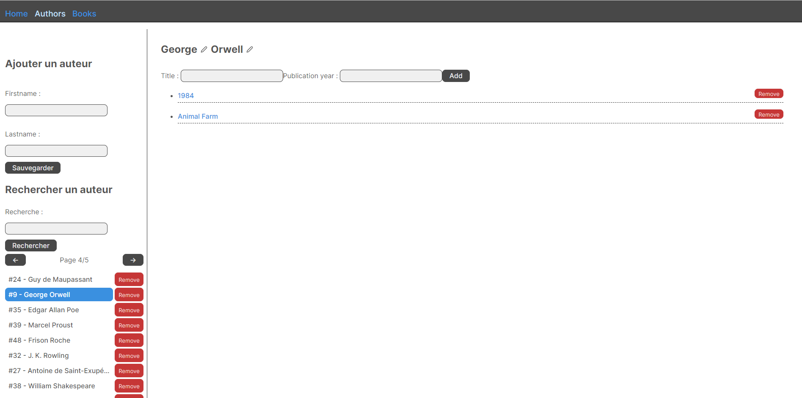
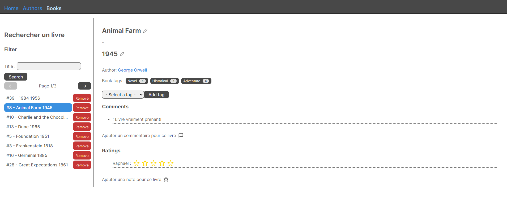

# Application web de gestion de livres et auteurs


# Consignes d'utilisation de l'application
## Initialiser l'API

Au besoin, supprimer le fichier tsconfig.json
Executer ces commandes (dans le dossier webApi) dans l'ordre pour pouvoir lancer correctement l'API: 

```
npm init -y

```
Créer un fichier .env à la source, et écrire ces deux lignes : 

```
DATABASE_URL="file:./dev.db"
JWT_SECRET="RANDOM_TOKEN_SECRET"
```

```
npm install -D typescript ts-node ts-node-dev @types/node
npx tsc --init
npm install express@next
npm install -D @types/express
npm run dev
```

## Initialiser la partie front-end

Dans le dossier webFront :

```
npm install
```

# Description de l'application

Nous avions comme objectif de réaliser une application web qui affiche une liste d'auteurs et leurs livres associés et une liste de livre avec leurs auteurs associés.
L'application devait permettre l'ajout et la suppression des livres et des auteurs, la navigation à travers la liste grâce à un système de pagination, la recherche dans la liste via un filtre.
Le livre devait pouvoir être modifié de plusieurs manière : 
- Modifications des informations de base (Titre, date de publications).
- Ajout ou suppression de tags associés au livre.

Nous avons rajouté les fonctionnalités suivantes :
- Possibilité de laisser un commentaire avec un nom d'utilisateur.
- Possibiliter de laisser une note avec un nom d'utilisateur.

Voici des captures d'écran de l'application : 



Cette première capture d'écran montre la vue obtenue en cliquant sur un auteur dans la liste qui affiche les livres qui lui sont associé.



Ici on a un aprçu de la vue obtenue en cliquant sur un des livres de l'auteur ou sur la liste des livres dans la partie Books.
